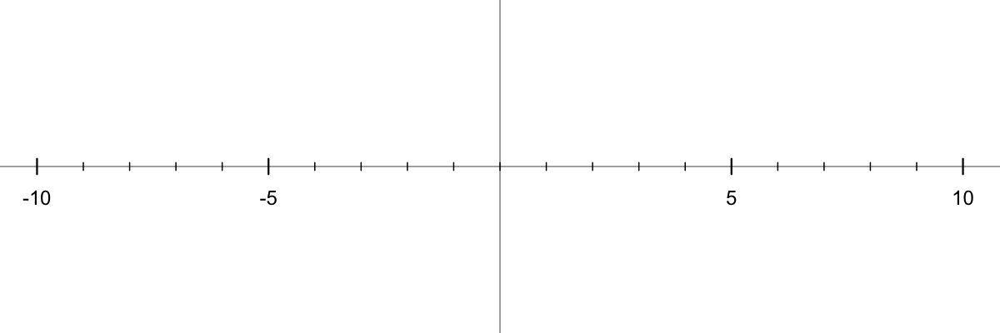

\renewcommand{\arraystretch}{1.2}

```{r,echo=F,warning=FALSE,message=FALSE}
options(scipen=999)
if(params$rseed !=0){
    set.seed(params$rseed)
}
knitr::opts_chunk$set(echo = FALSE)
bn <- basename(knitr::current_input())
bn = strsplit(bn,".",fixed=T)[[1]][1]

pn = function(coeffs,pows){
    pows = pows[coeffs!=0]
    coeffs = coeffs[coeffs!=0]
    ex1 = paste0("{",coeffs,"}x^{",pows,"}",collapse="+")
    ex1 = gsub("+{-","-{",ex1,fixed=T)
    ex1 = gsub("{1}x^{0}","1",ex1,fixed=T)
    ex1 = gsub("{-1}x^{0}","-1",ex1,fixed=T)
    ex1 = gsub("{1}x","x",ex1,fixed=T)
    ex1 = gsub("{-1}x","-x",ex1,fixed=T)
    ex1 = gsub("x^{0}","",ex1,fixed=T)
    ex1 = gsub("x^{1}","x",ex1,fixed=T)
    ex1 = gsub("+-","-",ex1,fixed=T)
    if(ex1 == ""){
        ex1 = "0"
    }
    ex1 = gsub("{","",ex1,fixed=T)
    ex1 = gsub("}","",ex1,fixed=T)
    return(ex1)
}
```

Name: \vspace{0.1in} \hrule

## `r bn` (v`r params$rseed`)

```{r,echo=F}
numq = 9
exps = c("y=(x+8)(x+4)^2(x+1)(x-3)^2","y=-(x+1)^2(x-5)(x-7)")
roots = list(c(-8,-4,-1,3),c(-1,5,7))
pows = list(c(1,2,1,2),c(2,1,1))
as = c(1,-1)
while(length(exps)<numq){
    n = sample(3:4,1)
    while(T){
        root = sort(sample(1:8,n)*sample(c(-1,1),n,T))
        pow = sample(1:2,n,T)
        if(min(diff(root))>1 && max(diff(root))<7 && sum(pow)>n && sum(pow)<2*n){break}
    }
    daord = 1:n
    if(length(exps)>4){
        daord = sample(1:n)
    }
    r2 = root[daord]
    p2 = pow[daord]
    a = ((length(exps)+1)%%2)*2-1 #sample(c(-1,1),1)
    exp1 = paste0("(x+",-r2,")^",p2,collapse="")
    exp1 = gsub("+-","-",exp1,fixed=T)
    exp1 = gsub("^1","",exp1,fixed=T)
    if(a==-1){
        exp1 = paste0("y=-",exp1)
    } else {
        exp1 = paste0("y=",exp1)
    }
    if(!(exp1 %in% exps)){
        exps = c(exps,exp1)
        roots[[length(roots)+1]] = root
        pows[[length(pows)+1]] = pow
        as = c(as,a)
    }
}

```

```{r,echo=F,fig.dim=c(6,2),results='hide'}
png("maybe.png",1200,400)
par(mar=c(0,0,0,0))
plot(0,0,"n",xlim=c(-10,10),ylim=c(-2,2),axes=F,ann=F)
abline(h=0)
abline(v=0)
for(i in -10:10){
    if(i%%5==0 && i!=0){
        lines(c(i,i),c(-0.1,0.1),lwd=3)
        text(i,-0.4,i,cex=2)
    } else{
        lines(c(i,i),c(-0.05,0.05),lwd=2)
    }
}
dev.off()
```

```{r,echo=F,fig.dim=c(6,2),results='asis',fig.align='center'}
for(i in 1:length(exps)){
    cat(paste0(i,". Sketch $",exps[i],"$\n\n"))
    cat("")
    cat("\n\n\\vfill\n\n")
    if(i%%3==0){
        cat("\\newpage\n\n")
    }
}
```

\newpage

```{r,echo=F,fig.dim=c(3,1.5),results='asis'}

fx = function(x,a,root,pow){
    b = a
    for(i in 1:length(root)){
        b = b*(x-root[i])^pow[i]
    }
    return(b)
}
library(latex2exp)
for(iii in 1:length(exps)){
    exp = exps[iii]
    # cat(paste0("$",exp,"$\n\n"))
    root = roots[[iii]]
    pow = pows[[iii]]
    a = as[iii]
    N = length(root)
    par(mar=c(0,0,3,0))
    plot(0,0,"n",axes=F,ann=F,xlim=c(-10,10),ylim=c(-2,2))
    mtext(TeX(paste0("$",exp,"$")),3)
    abline(v=0,lwd=1)
    abline(h=0,lwd=2)
    for(i in -10:10){
        if(i%%5==0 && i!=0){
            lines(c(i,i),c(-0.2,0.2))
            text(i,-0.5,i,cex=0.7)
        } else {
            lines(c(i,i),c(-0.1,0.1))
        }
    }
    xs = root
    xmid = c(xs[1]-1,(xs[2:N]+xs[1:(N-1)])/2,xs[N]+1)
    sss = 1.3
    xx = xmid[1]
    yy = sign(fx(xmid[1],a,root,pow))
    mm = -yy*sss
    for(i in 1:length(root)){
        xx = c(xx,xs[i])
        yy = c(yy,0)
        if(sign(fx(xs[i]-0.1,a,root,pow))==sign(fx(xs[i]+0.1,a,root,pow))){
            mm = c(mm,0)
        }
        if(sign(fx(xs[i]-0.1,a,root,pow))==-1 && sign(fx(xs[i]+0.1,a,root,pow))==1){
            mm = c(mm,sss)
        }
        if(sign(fx(xs[i]-0.1,a,root,pow))==1 && sign(fx(xs[i]+0.1,a,root,pow))==-1){
            mm = c(mm,-sss)
        }
        xx = c(xx,xmid[i+1])
        if(i<N){
            mm = c(mm,0)
            yy = c(yy,pi/2*sign(fx(xmid[i+1],a,root,pow)))
        } else {
            mm = c(mm,sign(a)*sss)
            yy = c(yy,sign(fx(xmid[i+1],a,root,pow)))
        }
    }
    xwave = seq(min(xs),max(xs),0.1)
    sf = splinefunH(xx,yy,mm)
    lines(xwave,sin(sf(xwave)),col="blue",lwd=3)
    points(root,rep(0,length(root)),pch=19,col="blue")
    xlo = seq(min(xs)-1,min(xs),0.1)
    lines(xlo,sf(xlo),col="blue",lwd=3)
    xhi = seq(max(xs),max(xs)+1,0.1)
    lines(xhi,sf(xhi),col="blue",lwd=3)
    
    # lines(c(max(root),max(root)+2),c(0,2*a),col="blue",lwd=3)
    # lines(c(min(root),min(root)-2),c(0,2*a*(-1)^n),col="blue",lwd=3)
    
    arrows(xx[2*N+1],yy[2*N+1],xx[2*N+1]+0.5,yy[2*N+1]+0.5*sign(a)*sss,col="blue",lwd=3,length=0.1,angle=15)
    arrows(xx[1],yy[1],xx[1]-0.5,yy[1]+0.5*sign(yy[1])*sss,col="blue",lwd=3,length=0.1,angle=15)
    # cat("\n\n")
}
```


