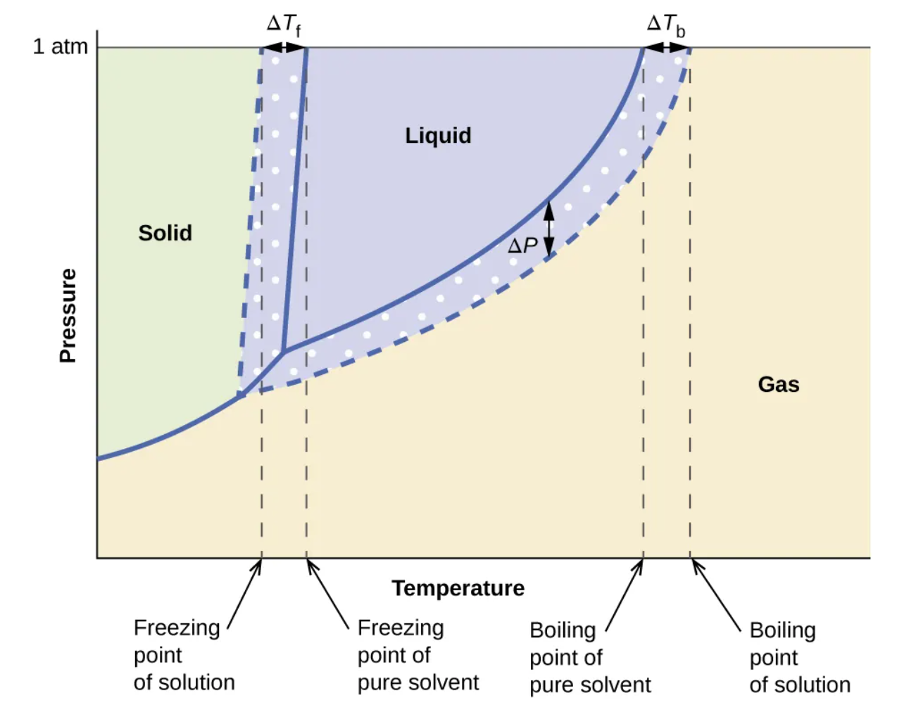
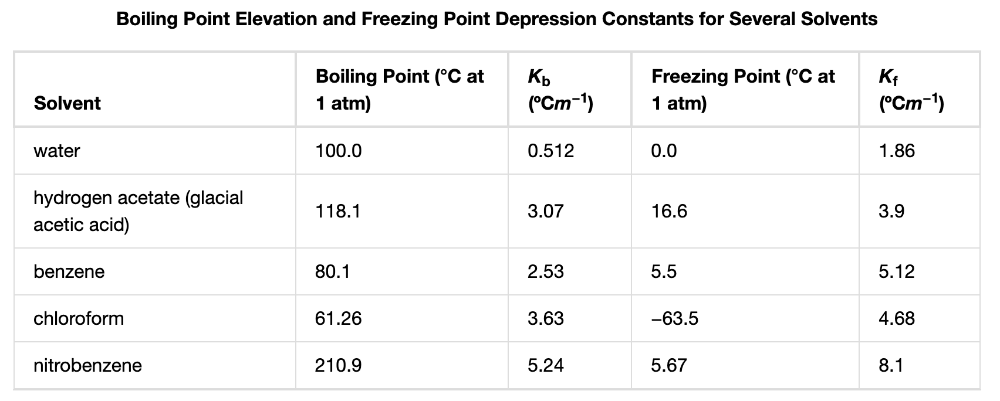

# Short URL for these slides

`https://shorturl.at/N89fZ`

# Entrance Ticket

The MOLALITY ($m$) of a solution equals the MOLES of solute divided by the KILOGRAMS of solvent.

$$m~=~\frac{\text{mol solute}}{\text{kg solvent}}$$

What is the molality of a solution made by dissolving 2.00 grams of $\mathrm{MgCl_2}$ into 50.0 grams of $\mathrm{H_2O}$?

# Solution to entrance ticket

<span style="color: grey;">The MOLALITY ($m$) of a solution equals the MOLES of solute divided by the KILOGRAMS of solvent.
$$m~=~\frac{\text{mol solute}}{\text{kg solvent}}$$
What is the molality of a solution made by dissolving 2.00 grams of $\mathrm{MgCl_2}$ into 50.0 grams of $\mathrm{H_2O}$?</span>


* The solute is the magnesium chloride, which has a molar mass of 95.211 g/mol. Calculate moles of solute. *Keep extra significant figures for intermediate calculations.*
$$(\text{2.00 g MgCl}_2)\cdot \frac{\text{1 mol MgCl}_2}{\text{95.211 g MgCl}_2}~=~`r signif(2/95.211,5)`\text{ mol MgCl}_2$$
* Convert the mass of water into kilograms. In this case, 50.0 grams of water is equivalent to 0.0500 kilograms of water (1000 g = 1 kg).
* Calculate molality. Express answer with 3 significant digits.

$$m~=~\frac{`r signif(2/95.211,5)`\text{ mol solute}}{0.0500 \text{ kg solvent}}$$

$$m~=~`r sprintf("%.3f",signif(2/95.211/0.05,3))` ~ \frac{\text{mol solute}}{\text{kg solvent}}$$

# Colligative Properties

When solute is added to a pure solvent, the solution's properties are different than the solvent. For example, sugar water is more viscous than pure water, and salty water is more dense than pure water.

The precise changes can be difficult to predict, and typically the changes depend on what type of solute is added.

**Colligative properties** depend only on the molality (or mole fraction) of solute particles... REGARDLESS of what solute is added. 

Examples:

* Change of **freezing point**
* Change of **boiling point**
* Change of **vapor pressure**
* Change of **osmotic pressure** (will be discussed in Biology)

(*Technically, these properties are only colligative for nonvolatile solutes in dilute solutions.*)

# Predict

Compare pure water and salty water. When we add salt to water, what happens to:

* freezing point
* boiling point
* vapor pressure

Take a minute to lock in your answers. Then, discuss your prediction with your neighbor.

# Solutes stabilize liquid solutions

Dissolving a nonvolatile solute into a liquid:

>- Lowers freezing point
>- Raises boiling point
>- Lowers vapor pressure (at any temperature)
>- {width=50%}
>- WHY?
>- Basically, either freezing or evaporating a solution also requires separating the solvent from the solute, and organization takes work. You will later study **entropy**, which is a measure of disorder, and you will learn $\Delta S_\text{universe}>0$.

# Freezing-point depression and boiling-point elevation

* The MATH:

$$\Delta T_\text{f} = -i \cdot K_\text{f} \cdot m $$
$$\Delta T_\text{b} = i \cdot K_\text{b} \cdot m $$

The van't Hoff factor, $i$, accounts for dissociation of solutes.


```{r,echo=F}
compound = c("glucose","NaCl","$\\mathrm{MgCl_2}$","$\\mathrm{(NH_4)_3 PO_4}$")
i = c(1,2,3,4)
df = data.frame(compound,i)

kableExtra::kable_styling(knitr::kable(df,col.names = c("solute","van't Hoff factor ($i$)")),bootstrap_options = "bordered",full_width = FALSE)
```

The solvent determines $K_\text{f}$ and $K_\text{b}$.

{width=80%}


# Example: continued from entrance ticket

When 2.00 grams of magnesium chloride are dissolved into 50.0 grams of water, the resulting solution has a molality of 0.420 moles/kg. \
Water's freezing-point-depression and boiling-point-elevation constants are known:
$$K_\text{f}= 1.86 ~\mathrm{\frac{^\circ C}{m}}$$
$$K_\text{b}= 0.512 ~\mathrm{\frac{^\circ C}{m}}$$
Use the provided information to estimate the freezing point and the boiling point of the resulting solution using the formulas:
$$\Delta T_\text{f} = -i \cdot K_\text{f} \cdot m $$
$$\Delta T_\text{b} = i \cdot K_\text{b} \cdot m $$

# Answer: continued from entrance ticket

<span style="color: grey;">When 2.00 grams of magnesium chloride are dissolved into 50.0 grams of water, the resulting solution has a molality of 0.420 moles/kg. \
Water's freezing-point-depression and boiling-point-elevation constants are known:
$$K_\text{f}= 1.86 ~\mathrm{\frac{^\circ C}{m}}$$
$$K_\text{b}= 0.512 ~\mathrm{\frac{^\circ C}{m}}$$
Use the provided information to estimate the freezing point and the boiling point of the resulting solution using the formulas:
$$\Delta T_\text{f} = -i \cdot K_\text{f} \cdot m $$
$$\Delta T_\text{b} = i \cdot K_\text{b} \cdot m $$</span>

Remember, each mole of $\mathrm{MgCl_2}$ dissociates into 3 moles of solute particles. Thus, the van't Hoff factor is $i=3$.

$$\Delta T_\text{f} = -3 \cdot 1.86 \cdot 0.420 = `r -3*1.86*0.420`$$
$$\Delta T_\text{b} = 3 \cdot 0.512 \cdot 0.420 = `r 3*0.512*0.420`$$

* Pure water freezes at 0°C, so this solution freezes at `r sprintf("%.2f",-3*1.86*0.420)`°C.
* Pure water boils at 100°C, so this solution boils at `r sprintf("%.3f",100+3*0.512*0.420)`°C.

# Example: saturated salty water

Sodium chloride has a maximum solubility of approximately 36 grams of NaCl in 100 grams of $\mathrm{H_2O}$.

1. Find the molality of this solution.
2. Estimate the freezing point of this solution (assuming an ideal solution).
3. Estimate the boiling point of this solution (assuming an ideal solution).

>- Useful information:
>- Molar mass of NaCl is 58.44 g/mol.
>- For water: $K_\text{f}= 1.86 ~\mathrm{\frac{^\circ C}{m}}$ and $K_\text{b}= 0.512 ~\mathrm{\frac{^\circ C}{m}}$
>- van't Hoff factor for NaCl is $i=2$.
>- At 1.0 Atm, water freezes at 0.0°C and boils at 100.0°C.
>- The formulas: $$\Delta T_\text{f} = -i \cdot K_\text{f} \cdot m $$ $$\Delta T_\text{b} = i \cdot K_\text{b} \cdot m $$

# Answer: saturated salty water

```{r,echo=F}
m = signif(36/100/58.44*1000,3)

```

1. Calculate molality.
$$\frac{36 ~\mathrm{g ~ NaCl}}{100 ~\mathrm{g ~ H_2O}} \cdot \frac{1 ~\mathrm{mol ~ NaCl}}{58.44 ~\mathrm{g ~ NaCl}} \cdot \frac{1000 ~\mathrm{g ~ H_2O}}{1 ~\mathrm{kg ~ H_2O}}~=~`r signif(36/100/58.44*1000,3)` ~\mathrm{\frac{mol~solute}{kg~solvent}}$$
2. Calculate freezing point.
$$\Delta T_\text{f} = -2 \cdot 1.86 \cdot `r m` = `r signif(-2*1.86*m,3)`~^\circ \mathrm{C}$$
Since pure water freezes at 0°C, we estimate this solution freezes at `r signif(-2*1.86*m,3)`°C. *The actual freezing point of saturated aqueous NaCl is -21.1°C.*
3. Calculate boiling point.
$$\Delta T_\text{b} = 2 \cdot 0.512 \cdot `r m` = `r signif(2*0.512*m,3)` ~^\circ \mathrm{C}$$
Since pure water boils at 100°C, we estimate this solution boils at `r 100+signif(2*0.512*m,3)`°C. *The actual boiling point of saturated aqueous NaCl is 108.7°C.*


# More Practice

https://shorturl.at/aSphP

https://artockthedino.github.io/chemistry/colligative/examples.html


