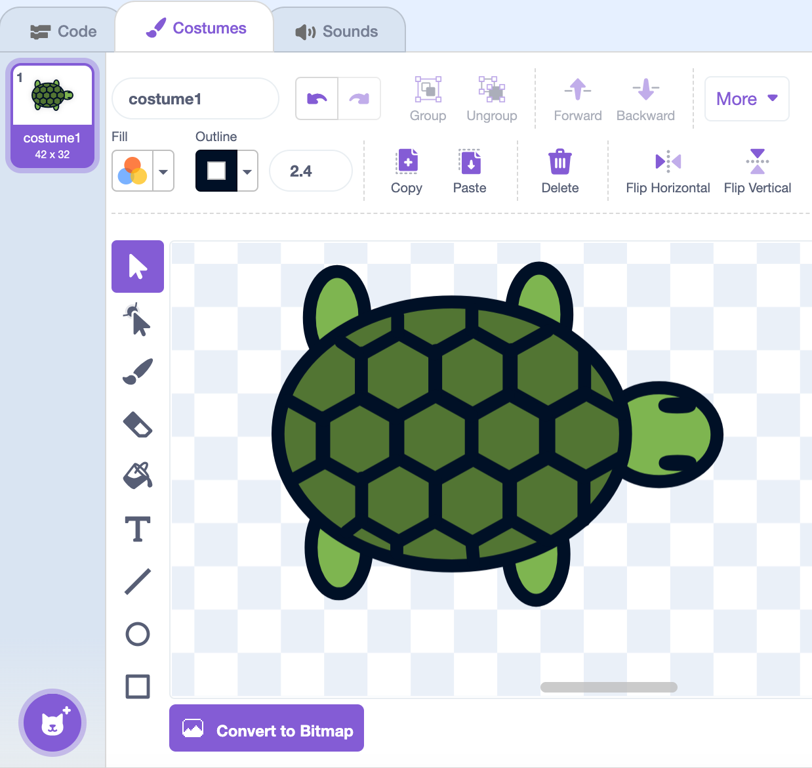
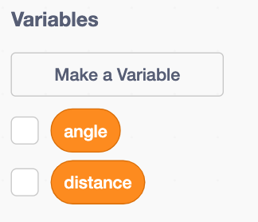
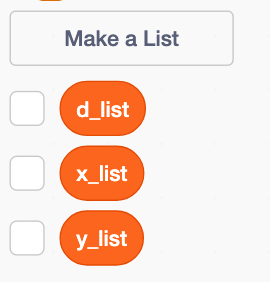
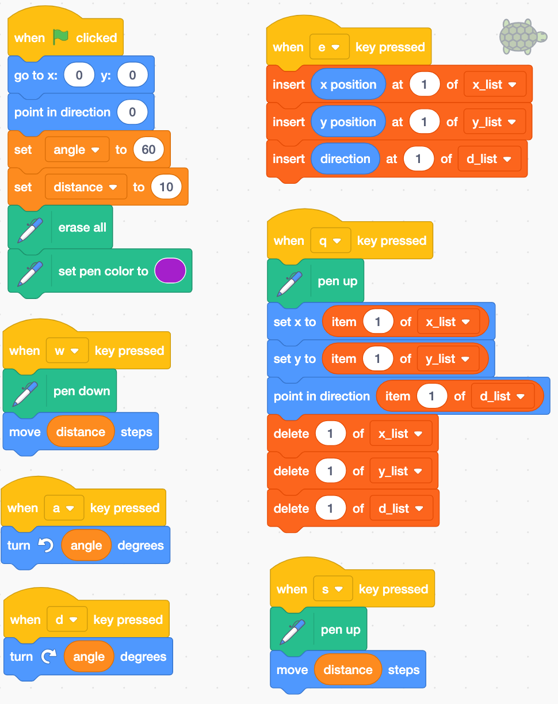

## Turtle_draw

You will submit a screenshot on Canvas to get credit for this assignment.

### L-system Turtle Graphics

* In Scratch, we wish to create the following:
    * A turtle sprite (from bird's-eye view)
    * Use keyboard buttons to control the turtle using the following moves:
        * W = Move forward
        * D = Turn right
        * A = Turn left
        * S = Hop forward (and do not draw)
        * E = Save position at top of list
        * Q = Return to top-of-list position and delete position from list

## Start a new project

1. Go to [https://scratch.mit.edu](https://scratch.mit.edu)
    * Login to save your work.
    * `Create` a new project. 
2. Click on `Costumes` to edit the cat.
    * Delete the 2nd costume.
    * Change the 1st costume to look like the following turtle:
    
{height=40%}

\newpage

3. Make the following variables and lists (for all sprites):

{height=30%} {height=30%}

4. Add the Pen extension! (Purple button in bottom left corner).

\newpage

5. Write the code (for your turtle sprite):




\newpage

6. Make the turtle sized small (just big enough to see it is a turtle in fullscreen mode).

7. Call over Mr. Worley to check that your buttons work.

8. Make a drawing!
    * Go to fullscreen mode.
    * Click the green flag to `Go`.
    * Type (slowly, carefully, without spaces) the following keys on your keyboard:
    
```{r,echo=F}
s = "[A[-ASA][+ASA]A[-A[-ASA][+ASA]ASSA[-ASA][+ASA]A][+A[-ASA][+ASA]ASSA[-ASA][+ASA]A]A[-ASA][+ASA]A][++A[-ASA][+ASA]A[-A[-ASA][+ASA]ASSA[-ASA][+ASA]A][+A[-ASA][+ASA]ASSA[-ASA][+ASA]A]A[-ASA][+ASA]A][--A[-ASA][+ASA]A[-A[-ASA][+ASA]ASSA[-ASA][+ASA]A][+A[-ASA][+ASA]ASSA[-ASA][+ASA]A]A[-ASA][+ASA]A]SSSSSSSSSSSS"
s = gsub("A","W",s,fixed=T)
s = gsub("B","W",s,fixed=T)
s = gsub("C","W",s,fixed=T)
s = gsub("+","D",s,fixed=T)
s = gsub("-","A",s,fixed=T)
s = gsub("[","E",s,fixed=T)
s = gsub("]","Q",s,fixed=T)

s2 = ""
for(i in 1:(nchar(s)/4)){
    s2 = paste0(s2,substr(s,(i*4-3),(i*4))," ")
    if(i%%10==0){
        s2 = paste0(s2,"\n\n",collapse="")
    }
}

```

\LARGE
```
`r s2`
```
\normalsize

\vfill

8. **Submit** a screenshot of the drawing **on Canvas** under assignment `Turtle_draw`.

\vfill

    