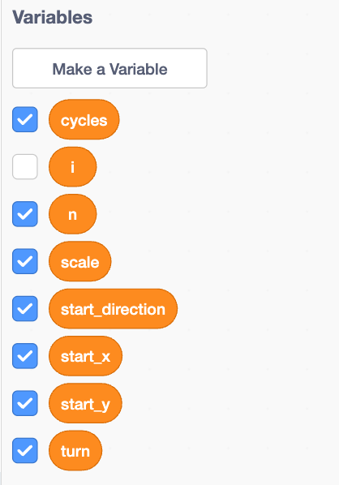
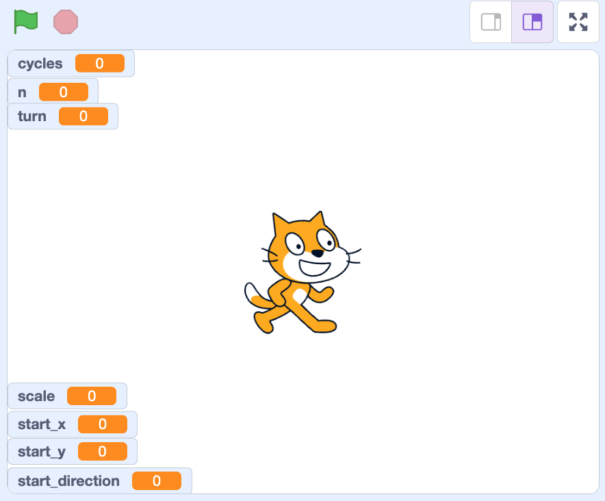
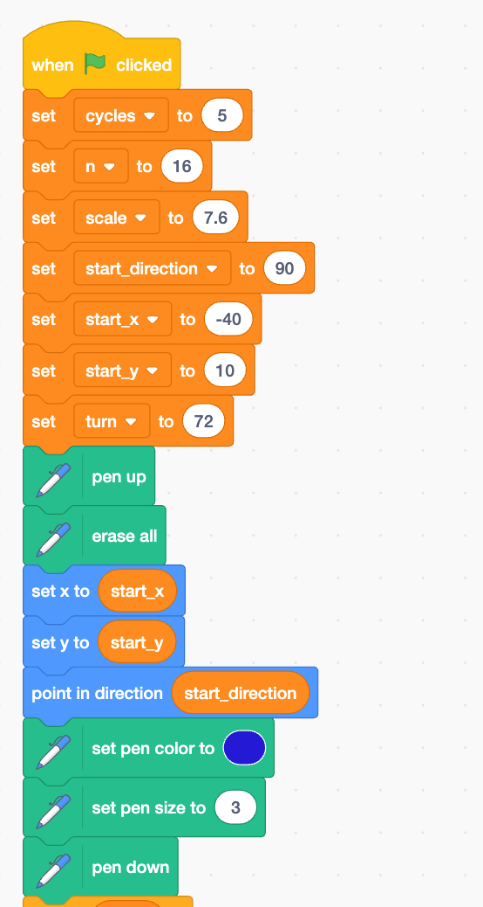
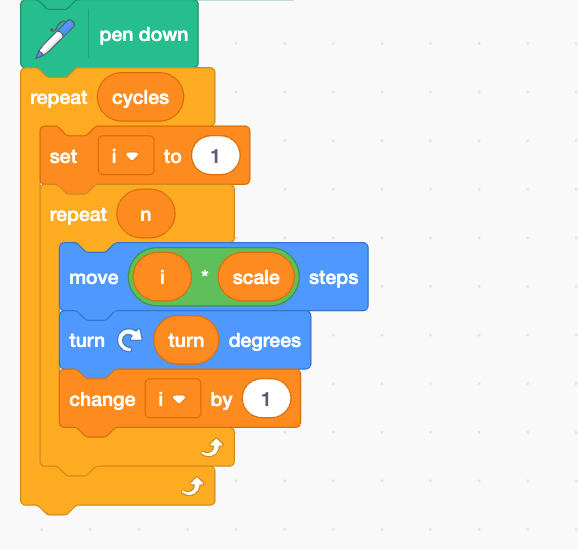
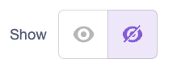

# Scratch Spirolaterals

```{r,echo=F,fig.dim=c(7,0.5)}
drawit = function(L=16,dD=-pi/2,D=-pi/2,n=1000){
    x = c(0)
    y = c(0)
    l = L
    for(i in 1:n){
        x0 = x[i]
        y0 = y[i]
        x2 = x[i]+l*cos(D)
        y2 = y[i]+l*sin(D)
        l = (l-2)%%L+1
        D = D+dD
        x = c(x,x2)
        y = c(y,y2)
    }
    xmin = min(x)
    xmax = max(x)
    xmid = mean(c(xmin,xmax))
    ymin = min(y)
    ymax = max(y)
    ymid = mean(c(ymin,ymax))
    r = max(c(xmax-xmid,ymax-ymid))
    xlo = xmid-r
    xhi = xmid+r
    ylo = ymid-r
    yhi = ymid+r
    plot(0,0,"n",axes=F,ann=F,xlim=c(xlo,xhi),ylim=c(ylo,yhi))
    lines(x,y,lwd=0.4)
}

set.seed(123)

par(mfrow=c(1,14),mar=c(0,0,0,0),pty="s",oma=c(0,0,0,0))
Ls = sample(6:30,14,T)
denoms = sample(3:19,14,T)
nums = numeric()
for(i in 1:length(denoms)){
    nums = c(nums,sample(1:(denoms[i]-1),1))
}
dDs = pi*nums/denoms

Ls[12] = 9
dDs[12] = -pi/2

Ls[10] = 19
dDs[10] = -pi/3

Ls[6] = 9
dDs[6] = 175/180*pi

for(i in 1:length(denoms)){
    drawit(L=Ls[i],dD=dDs[i])
}


```

Spirolaterals have segment lengths that repeatedly grow from 1 to $n$ while turning $\theta$° after each segment. In the example below, the segment lengths repeatedly grow from 1 to 16 while turning 72° after each segment.

```{r,echo=F,fig.dim=c(0.5,0.5)}
x = c(0)
y = c(0)
n = 1000
L = 16
l = L
D = pi/2
dD = -2*pi/5
for(i in 1:n){
    x0 = x[i]
    y0 = y[i]
    x2 = x[i]+l*cos(D)
    y2 = y[i]+l*sin(D)
    l = (l-2)%%L+1
    D = D+dD
    x = c(x,x2)
    y = c(y,y2)
}
xmin = min(x)
xmax = max(x)
xmid = mean(c(xmin,xmax))
ymin = min(y)
ymax = max(y)
ymid = mean(c(ymin,ymax))
r = max(c(xmax-xmid,ymax-ymid))
xlo = xmid-r
xhi = xmid+r
ylo = ymid-r
yhi = ymid+r
par(mar=c(0,0,0,0),pty="s")
plot(0,0,"n",axes=F,ann=F,xlim=c(xlo,xhi),ylim=c(ylo,yhi))
lines(x,y)
```


Our goal is to produce these patterns in Scratch. You will **submit a slideshow** with a variety of your best results. You need to have at least 6 high-quality images of distinct spiral patterns for full credit. Each image should also show the parameter settings used to generate the image.

1. Go to [scratch.mit.edu](https://scratch.mit.edu)
    * Login (to save your work)
    * **Create a new project** (click "Create" near top of page.)
    * Name the project "My Spirolaterals" or something like that.
2. Click "Add Extension" button (bottom left of screen).
    {width=5%}
    * Choose the **Pen extension**.
3. Make some variables.
    * On left side, click the "Variables" section of code. (The orange dot.)
    * For each variable we need, click "Make a Variable", and then type the variable name (and use "For all sprites").
    * **Make 7 variables**:
        * \color{red}`cycles`\color{black}: how many times to repeat the cycle of counting up to `n`.
        * \color{red}`i`\color{black}: the current counting number. It starts at 1, increases by 1 after each segment, and returns to 1 after reaching `n`.
        * \color{red}`n`\color{black}: the highest number when counting up before going back to 1.
        * \color{red}`scale`\color{black}: a multiplier to make drawing bigger or smaller.
        * \color{red}`start_direction`\color{black}: the direction to move at start of drawing.
        * \color{red}`start_x`\color{black}: the $x$ coordinate to start the drawing.
        * \color{red}`start_y`\color{black}: the $y$ coordinate to start the drawing.
        * \color{red}`turn`\color{black}: angle turned after each segment
    * We want all the parameters to show on the screen, so keep them checked. Uncheck `i`, because it will change rapidly during the code run; `i` is not a parameter.\
    {width=25%}

\newpage    

4. In the right-most frame, rearrange the parameter readouts by clicking and dragging.
    * The drawings will be mostly circular-ish, so make room for a large circle.\
    {width=50%}
5. Start the code. In the left-most frame, find the correct elements, and drag them into place.\
{height=60%}
    
    
\newpage

6. Code the drawing loop. Notice the nested repeat loops (the second one is INSIDE the first one). \
{height=40%}
7. Hide the sprite. (Hide the cat.)
    * Near the bottom-right frame, click the show/hide sprite toggle.\
    {width=20%}
8. Turn on Turbo Mode.
    * Click `Edit` and then click `Turn on Turbo Mode`
9. **DOCUMENT** your own favorite 6 patterns in a slideshow!
    * Adjust the parameters in the top of the code, click the green flag to run the code.
        * The main parameters are `n` and `turn`. These fundamentally alter the pattern drawn.
            * For `turn`, you should use a simple fraction of 360. Some examples are 30, 45, 60, 72, 90, 108, 120, 135, and 150.
        * Choose a large enough `cycles` so the drawing returns to the starting position. If you just set it to 9999 (with Turbo Mode ON), then it should always work, but it might not look as good.
        * **DO NOT** let drawing hit edge of screen. Use a smaller `scale` value or adjust `start_x` and `start_y` if this happens.
    * Try to make the drawing as large as possible without hitting the edge of the window or going behind the readouts.
    * **Document your best patterns**. 
        * Start a new slideshow. Use [slides.new](https://slides.new) for google slides.
        * For a title page, include your name, date, and a title... something like "My Favorite Spirolaterals"
        * When you have a high-quality spirolateral, take a screenshot including the readouts. Paste the screenshot into the slideshow as its own slide.
    * Adjust the color of curve.
        * Try to make the color change during the drawing (for extra credit)!
        
**SUBMIT YOUR SLIDESHOW ON CANVAS!!**
        
        
        
        
